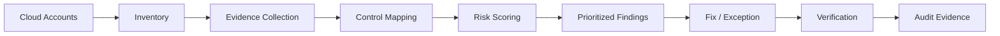

# Cloud Security Posture Management Lab

> **A small, executable CSPM reference project that turns cloud findings into prioritized security decisions.**

This repository is a public portfolio project by **Tarak Bach-Hamba** focused on cloud security architecture, control design, risk prioritization and remediation.

## What it demonstrates

- cloud security control modelling
- severity and exposure-based prioritization
- machine-readable findings
- repeatable scoring
- CI validation
- architecture and remediation thinking

## Reference flow



## Run it

```bash
python3 scripts/score.py examples/sample-findings.json
```

Example output:

```text
CRITICAL  public-storage-001      score=100  Public storage containing sensitive data
HIGH      iam-admin-001           score=85   Human principal with standing admin access
MEDIUM    logging-gap-001         score=55   Control-plane logging incomplete
```

## Repository map

| Path | Purpose |
|---|---|
| `docs/reference-architecture.md` | CSPM operating model and trust boundaries |
| `checks/control-catalog.yaml` | Example cloud security control catalogue |
| `examples/sample-findings.json` | Evidence-backed example findings |
| `scripts/score.py` | Deterministic prioritization CLI |
| `.github/workflows/validate.yml` | CI smoke test |

## Design principles

1. **Evidence before score** — every finding should point to observable configuration or telemetry.
2. **Exploitability matters** — severity alone is not prioritization.
3. **Identity is part of cloud posture** — standing privilege and delegation paths are first-class risks.
4. **Exceptions must expire** — accepted risk is not permanent permission.
5. **Verification closes the loop** — remediation is complete only when the control is re-evaluated.

## Portfolio context

This project complements my work on GenAI security and agent security. The common theme is **controlling consequential effects across identity, policy, runtime and evidence boundaries**.

## Author

**Tarak Bach-Hamba** — AI Security · GenAI Architecture · Cloud Security

## License

MIT
