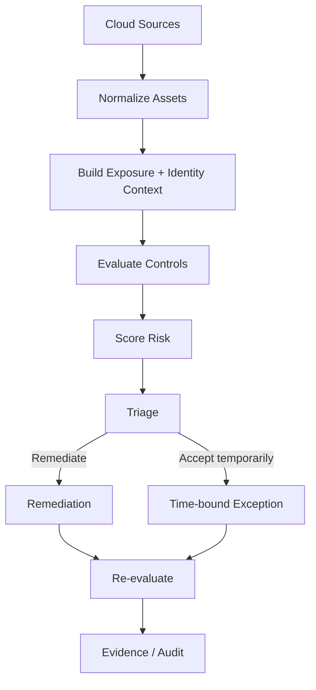

# CSPM Reference Architecture

## Objective

A CSPM system should do more than list misconfigurations. It should help a security team answer:

- What is exposed?
- What identity can reach it?
- What is the likely impact?
- Which control failed?
- What should be fixed first?
- How do we prove the fix?

## Operating model

## Prioritization dimensions

A useful score combines:

- baseline severity
- internet exposure
- data sensitivity
- privilege level
- exploitability
- compensating controls

The sample implementation intentionally stays small so the decision model is easy to inspect.
